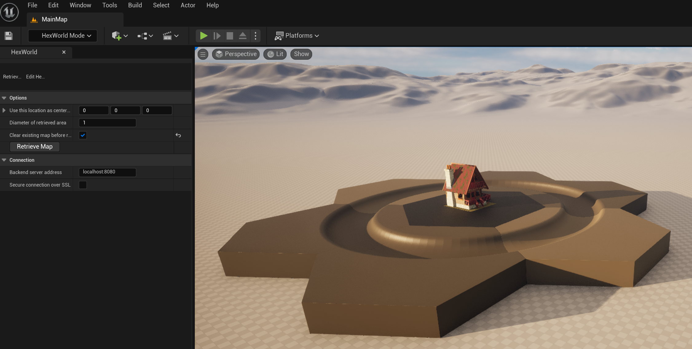
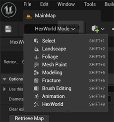
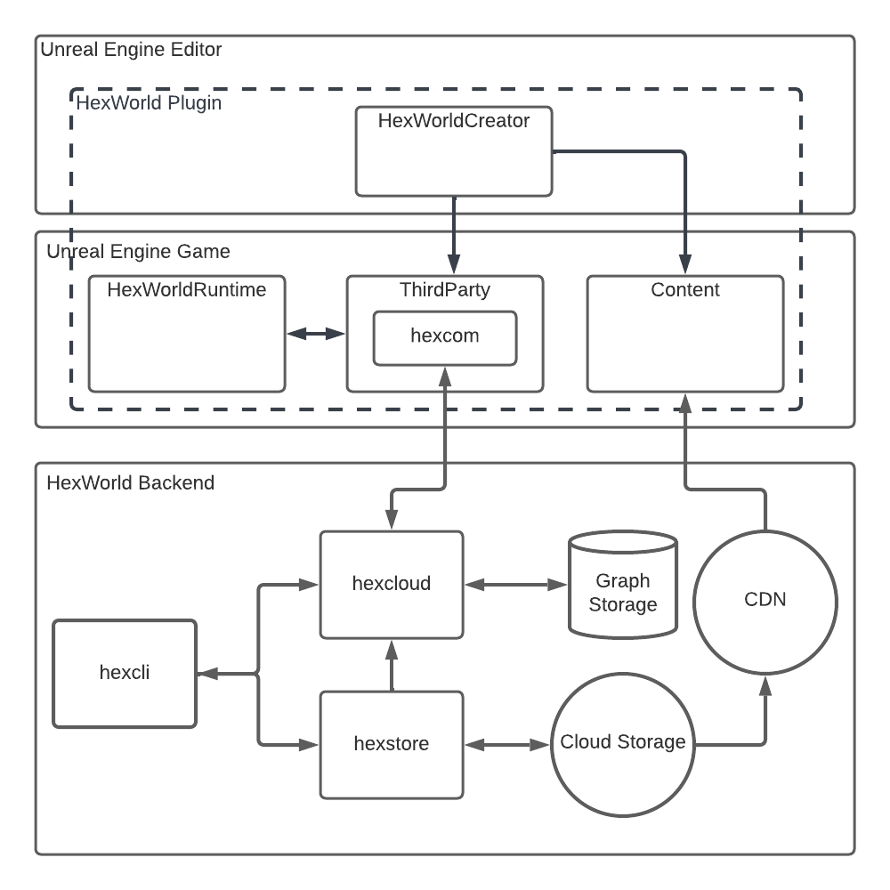
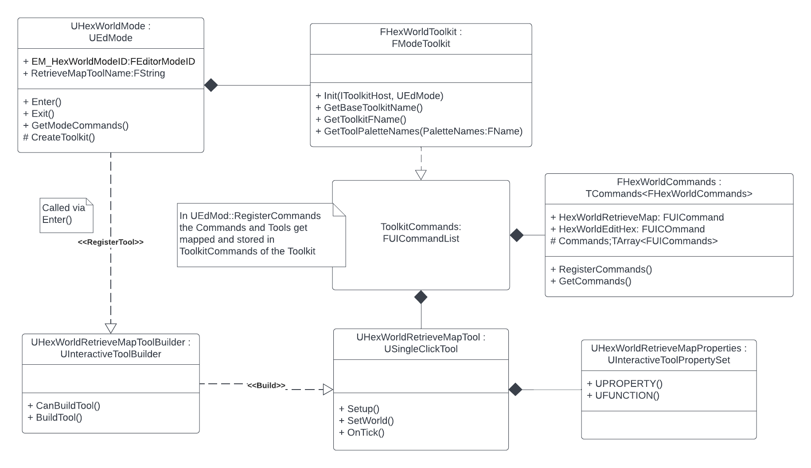
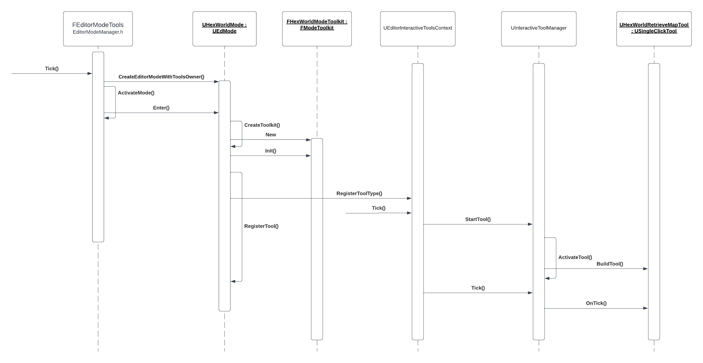

# HexWorld Plugin
With the HexWorld Unreal Engine 5 plugin you can edit and run hexagon maps. It communicates via a backend to get 
the meta-data and uses this data to place the content on the map. The editor is extended with a 'HexWorld' mode 
which can be used to retrieve the hexagon map data. 

## Install and Run
1. Clone project in the Plugins folder of an Unreal Engine 5 game. 
2. Run [hexcloud](https://github.com/3vilM33pl3/hexcloud) backend server 
3. Go in `HexWorld` editor mode

4. Push 'Retrieve Map'

## Plugin Modules and Content
The plugin consists of three modules and a content directory. 
### 1. HexWorldCreator
Editor module for retrieving and editing the hexagon map via a sidebar extension. 
### 2. HexWorldRuntime
Game module. Contains the dynamic hexagon map used in the game.
### 3. ThirdParty
Encapsulates the communication module (maintained in the [hexcom](https://github.com/3vilM33pl3/hexcom) repository) 
which communicates over gRPC with the backend [hexcloud](https://github.com/3vilM33pl3/hexcloud) 
### 4. Content
Default content of the hexagon map maintained in the [hexassets](https://github.com/3vilM33pl3/hexassets) repository.

## Architecture
### Overview HexWorld Eco System

### HexWorld Creator UML Class diagram

### HexWorld Creator Sequence Diagram
Tools gets created and registered by the UEDMode class. The tool manager activates the tool and calls `OnTick()` every frame.
